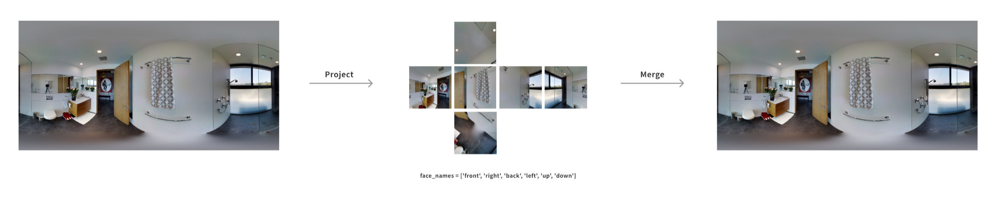

# Cubemap2Equirect
该项目是一个用于360度图像转换的工具，支持将立方体图像（cubemap）转换为全景图像（equirectangular），以及将全景图像转换为立方体图像。

## 功能
- 将等距矩形图像转换为立方体格式。
- 将立方体图像转换回等距矩形格式。

## 依赖
- Python 3.x
- NumPy
- SciPy
- Pillow

## 示例用法

 

您可以通过取消注释脚本中 `__main__` 部分的函数调用来运行提供的示例。

```python
if __name__ == "__main__":
    # 示例 1：将等距矩形图像转换为立方体
    convert_equirectangular_to_cubemap('image.png', 'cubemap_output', face_width=1024)

    # 示例 2：将立方体图像转换为等距矩形
    convert_cubemap_to_equirectangular('cubemap_output', 'equirectangular.png', output_height=2048, output_width=4096)
